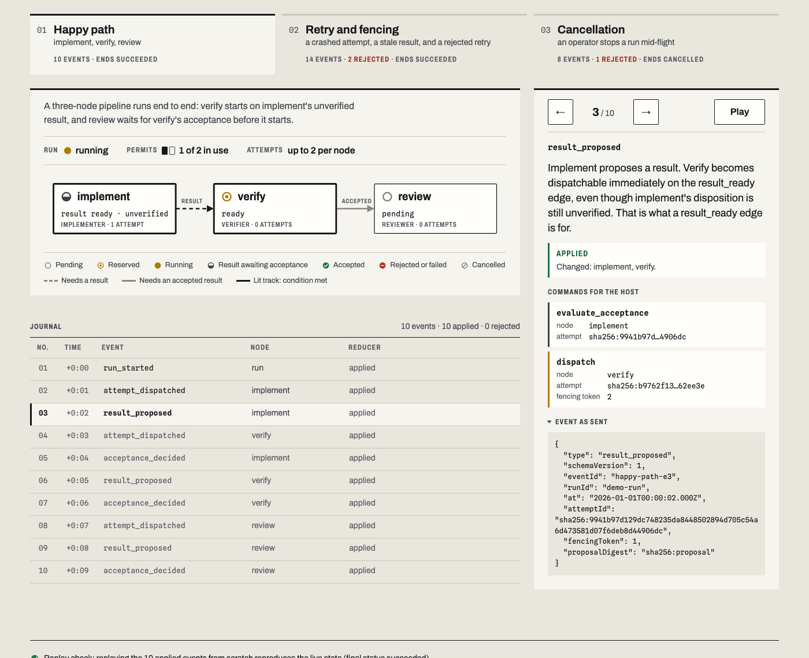
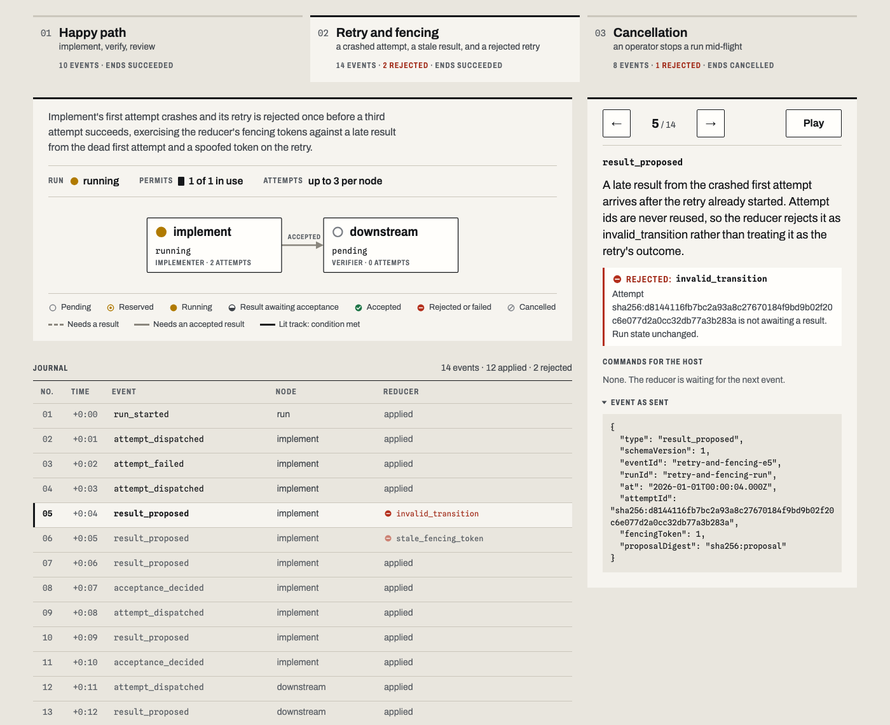
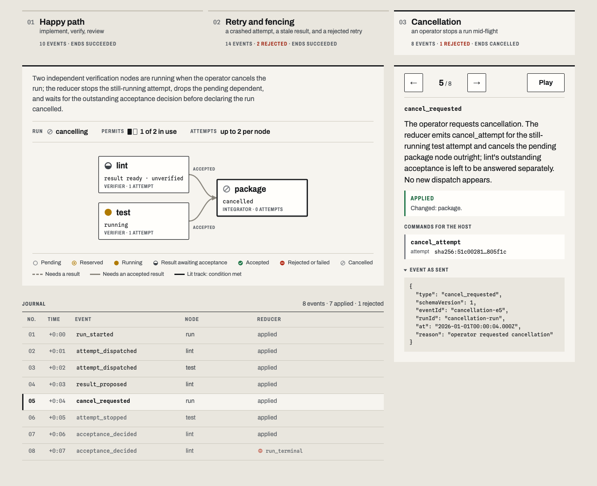

# auto-pi-lot

[](https://github.com/sebastianspicker/auto-pi-lot/actions/workflows/ci.yml)
[](https://sebastianspicker.github.io/auto-pi-lot/)

Graph mode for the [Pi coding agent](https://www.npmjs.com/package/@earendil-works/pi-coding-agent):
a local harness that turns a coding task into a graph of smaller tasks, runs them with
bounded retries, and only trusts a result once the host has checked it.

The rule behind the design is that **agents propose, the harness decides**. A model can suggest
a plan or report that its work is done. Deterministic code validates the plan, schedules each
attempt, enforces limits and decides whether a result is accepted.

> **Status: early foundation.** The deterministic core is built and tested: graph
> validation, a pure run reducer and the Pi session adapter. Running real tasks end to end
> (storage, worker processes, the supervisor, `/graph on`) is not built yet. See the
> [roadmap](docs/roadmap.md).

**[Open the interactive trace viewer](https://sebastianspicker.github.io/auto-pi-lot/)**

## Tour

The trace viewer replays real output from the run reducer: a scripted host sends events, and
the reducer decides what happens next. Nothing in it calls a model.

### A run, step by step



`implement → verify` is a *result* edge, so the verifier can start on a result that has not
been accepted yet. `verify → review` is an *accepted* edge, so the reviewer waits until the
host has accepted the verification. Each step shows the event, whether the reducer applied it,
and the commands it hands back to the host.

### Retries and stale workers



When an attempt fails, the reducer schedules a new attempt with a new ID and a higher fencing
token. A late message from the old attempt, or one carrying the wrong token, is rejected and
leaves the state untouched. Rejected events are marked in red in the journal, with their typed reason.

### Cancellation



Cancelling a run stops running attempts, cancels work that hasn't started, and waits for
outstanding acceptance decisions before the run is marked cancelled. Events that arrive after
that point are rejected.

## Quick start

You need Node.js 22.19 or newer. No model credentials are needed.

```sh
git clone https://github.com/sebastianspicker/auto-pi-lot.git
cd auto-pi-lot
npm ci --ignore-scripts
npm run check        # build, tests, lint, import boundaries, docs checks
npm run demo         # print a validated example graph and its ready nodes
node packages/cli/dist/index.js trace   # print the scripted run traces as JSON
```

To load the Pi extension, build first and point Pi at it:

```sh
pi --extension ./packages/pi/dist/extension.js
```

For now `/graph` only reports that graph mode is not available yet.

## How it works

- **Graphs are validated data.** A plan is a graph of nodes and dependency edges. It is
  parsed strictly and checked for duplicate IDs, unknown endpoints, cycles, ownership and
  the depth limit. A graph that passes gets a `ValidatedGraph` type; the rest of the system
  accepts nothing else.
- **One pure reducer runs the graph.** `decide(state, event)` returns the next state plus
  commands for the host, such as "dispatch this attempt" or "evaluate this result". Stale,
  duplicate or out-of-order events are rejected with a typed reason. Recovery replays the
  event log through the same function.
- **Results are proposals.** A worker's result is `unverified` until the host's acceptance
  gate decides. An edge says whether the next task needs any result (`result_ready`) or an
  accepted one (`accepted`).
- **Providers stay at the edge.** The core knows nothing about Pi or any model API. The Pi
  adapter translates the SDK's session events into provider-neutral ones, and never reports
  missing token usage as zero.

The full target design, including child graphs, budgets, workspaces and recovery, is in
[docs/design.md](docs/design.md).

## Repository layout

| Path | Contents |
| --- | --- |
| [`packages/core`](packages/core/README.md) | Deterministic domain: schemas, graph validation, run reducer, evidence records, session port |
| [`packages/pi`](packages/pi/README.md) | Everything that touches the Pi SDK: the session adapter and the `/graph` extension |
| [`packages/cli`](packages/cli/README.md) | `demo` and `trace` commands, and later the local supervisor |
| [`site/`](site) | The trace viewer published to GitHub Pages |
| [`docs/`](docs/architecture.md) | Architecture, design, roadmap, decision records |

Import boundaries between packages are enforced by Biome as part of `npm run lint`.

## Documentation

- [Architecture](docs/architecture.md): what exists, the package boundaries, and where new code goes
- [Design](docs/design.md): the complete product this repository is building toward
- [Roadmap](docs/roadmap.md): milestones and current status; the [ledger](docs/implementation-ledger.json) has the details
- [Acceptance scenarios](docs/acceptance-matrix.md): the failure cases the finished system must handle
- [Decision records](docs/decisions/README.md): why things are the way they are

## Contributing

See [CONTRIBUTING.md](CONTRIBUTING.md). Coding agents working in this repository follow
[AGENTS.md](AGENTS.md).

## License

[MIT](LICENSE) © 2026 Sebastian Spicker
