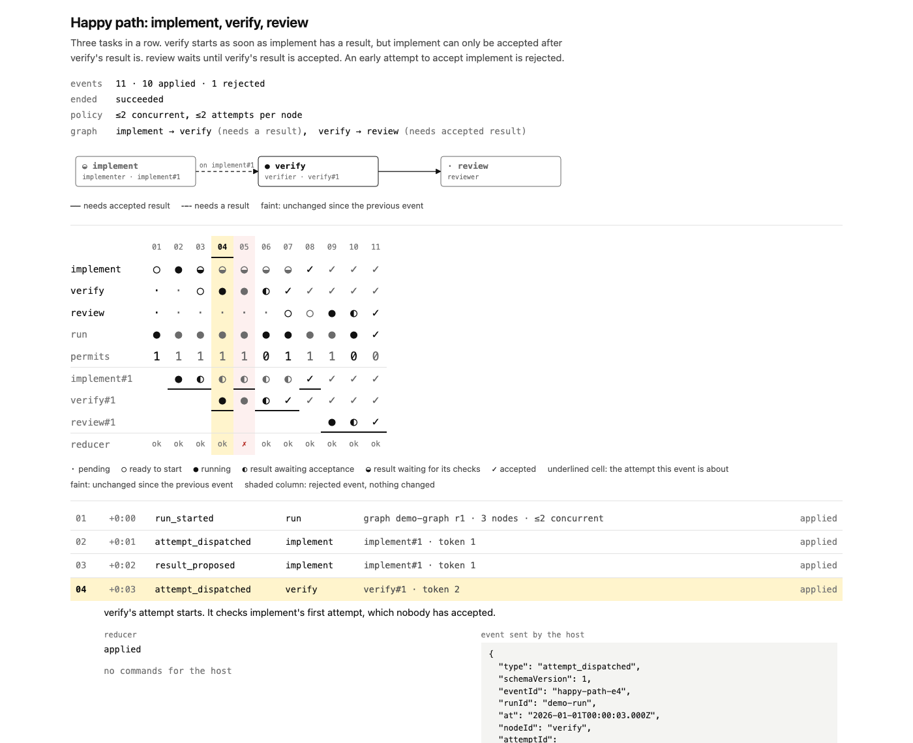
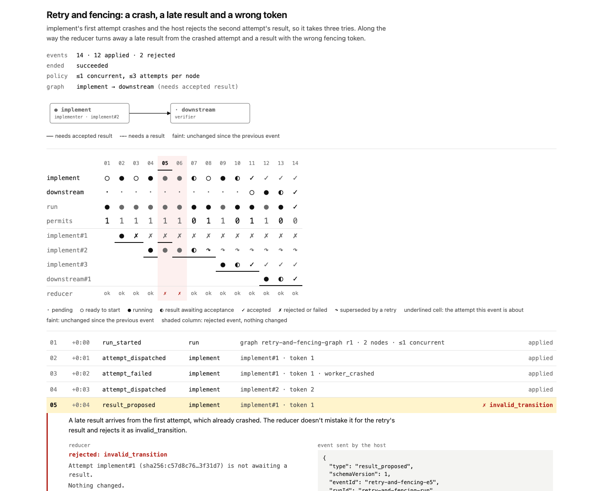
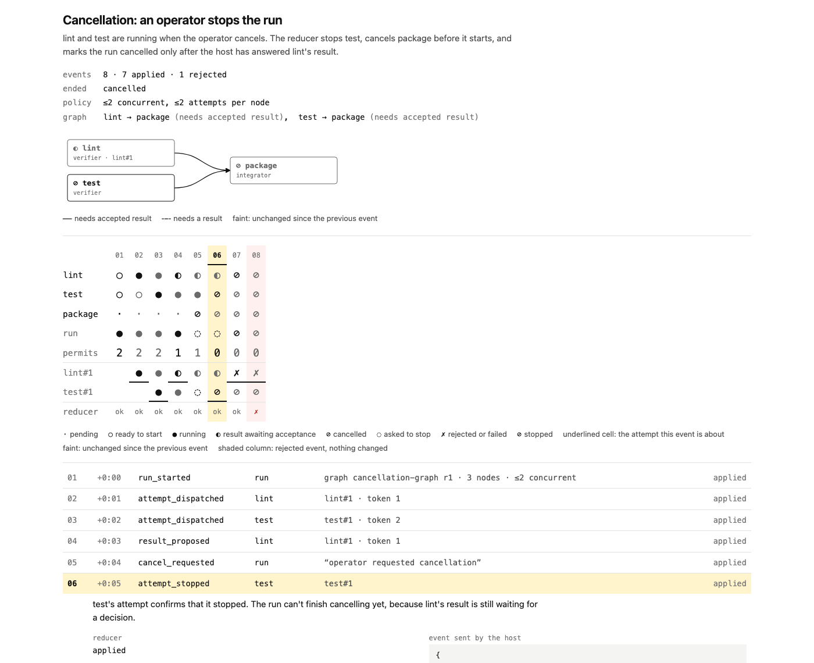

# auto-pi-lot

[](https://github.com/sebastianspicker/auto-pi-lot/actions/workflows/ci.yml)
[](https://sebastianspicker.github.io/auto-pi-lot/)

**In short.** auto-pi-lot runs a plan of coding tasks on your repository through the
[Pi coding agent](https://www.npmjs.com/package/@earendil-works/pi-coding-agent), one task
per AI session, with limits on tool calls, tokens and retries, and it trusts no result until
your own checks (tests, linters, builds) have passed on the exact tree the session left behind
and, where the plan says so, an independent reviewer session has judged it. Every decision is
written to an append-only journal before it is acted on, every receipt is stored as evidence
you can inspect, and a run survives a restart. You can watch the decision core work in the
**[interactive trace viewer](https://sebastianspicker.github.io/auto-pi-lot/)**.

> **Status: local, experimental.** Built and tested: plan checking, the decision function
> (the *reducer*), the host with its journal and evidence stores, the evidence-based
> acceptance gate, the check runner, the session worker over the Pi SDK and the command-line
> tool (`init`, `run`, `inspect`, `status`). Not built yet: worker processes and the background
> supervisor, separate worktrees for parallel writers, run-wide budgets, nested plans, the
> SQLite store and graph mode inside Pi (`/graph on`). Whether graph mode produces better code
> than a single Pi session has not been measured. See the [roadmap](docs/roadmap.md).

*About this page.* It is a plain-language edition of the project README, written for
software engineers and engineering leads who use AI coding tools but do not know this
project's internals. Bracketed references such as [README: Tour] point to the section of the
original document this edition was rewritten from; the originals are in the Git history at
commit `bf04bd0`. Terms in *italics* on first use are defined in the [glossary](#glossary).

## Why this exists

The project treats anything a model says about its own work as a claim to be checked, not
a fact. Its rule is **agents propose, the harness decides** [README: intro]. A model may
suggest a plan or report that its work is done. Deterministic code, meaning code that always
gives the same answer for the same input and never calls a model, checks the plan, schedules
each *attempt*, enforces limits and decides whether a result is accepted. Throughout these
documents, the *harness* is auto-pi-lot as a whole and the *host* is the non-AI program
inside it that drives the decisions and carries them out.

## See it working: the trace viewer

The [trace viewer](https://sebastianspicker.github.io/auto-pi-lot/) shows real output from
the reducer. A scripted host sends *events* (messages such as "this attempt started" or
"this worker proposes a result"), and the reducer decides what happens next. Nothing in the
viewer calls a model [README: Tour].

### A run, step by step



The example plan has three tasks: *implement*, then *verify*, then *review*. The link from
implement to verify only **needs a result**, so the verifier may start on a result that
nobody has accepted yet; that is its job. The link from verify to review **needs an accepted
result**, so the reviewer waits until the host has accepted the verification. Each line of the
log shows the event, whether the reducer applied it, and the instructions (*commands*) it hands
back to the host; the matrix above it shows every task's state after each event. [README: A run, step by step]

### Retries and stale workers



When an attempt fails, the reducer schedules a new attempt with a new ID and a higher
*fencing token*, a number that goes up with every new attempt. A late message from the old
attempt, or one carrying the wrong number, is rejected and changes nothing. This protects
against a crashed or slow worker overwriting the work of its replacement [Design §10;
Acceptance scenarios AT-19]. In the viewer, a rejected event is a shaded matrix column in
which no task's state changes, and its log line carries the typed reason in red. [README: Retries and stale workers]

### Cancellation



Cancelling a run stops running attempts and cancels work that has not started. The run is
only marked cancelled once every outstanding acceptance decision has been answered. Events
that arrive after that point are rejected. [README: Cancellation]

### Repair

When a check fails, the host rejects the task that produced the result, not the checker. In
the repair scenario *verify* finds a failure in *implement*'s first attempt and the host
rejects *implement*. *verify*'s result is thrown out and runs again against the new
*implement* attempt, without using up *verify*'s own retries. A checker that is still running
when its attempt is replaced is told to stop, and a result it sends late is rejected. The
reducer asks for *implement*'s acceptance only after *verify*'s evidence for that same attempt
has been accepted. [README: Repair]

## Run it on your repository

You need Node.js 22.19 or newer, Git, and Pi credentials for at least one model provider
(run `pi` once and log in, or set the provider's API key the way Pi documents it). The
`run --worker pi` step spends model credit and edits the files in your repository in place, so
start it on a branch or a clean tree.

```sh
git clone https://github.com/sebastianspicker/auto-pi-lot.git
cd auto-pi-lot && npm ci --ignore-scripts && npm run build
alias auto-pi-lot="node $PWD/packages/cli/dist/index.js"

cd ~/your/project
auto-pi-lot init                 # writes auto-pi-lot.json (your checks, found in package.json scripts) and auto-pi-lot.plan.json
$EDITOR auto-pi-lot.plan.json    # say what to implement and what must be true afterwards
auto-pi-lot validate auto-pi-lot.plan.json
auto-pi-lot run --worker pi --graph auto-pi-lot.plan.json
auto-pi-lot status               # every run in .auto-pi-lot/journal with its status
auto-pi-lot inspect <runId>      # state, attempts, proposals, check receipts, reviews, acceptance reasons
```

What happens in `run --worker pi`: the plan is checked; for each task that is ready, one
closed Pi session opens in your repository with only the tools its role allows (a reviewer
reads, an implementer edits); the session gets the objective, the acceptance criteria, the
results it builds on and, after a rejection, the evidence that rejected the previous attempt;
when it settles, the harness itself fingerprints the tree, runs the checks the task names
from `auto-pi-lot.json` (no shell, bounded logs, timeout) and records the receipts; a reviewer
task's verdict becomes a review receipt; the gate accepts a result only from those records.
Writers run one at a time in the one workspace; a rejected task is retried with the receipts
attached, up to the attempt limit. `Ctrl-C` cancels the run (sessions are aborted and a running
check is killed) and the journal keeps everything; `run --worker pi --resume <runId>` continues
an interrupted run from the same workspace.

Without credentials you can still exercise the whole machinery with the stand-in worker:

```sh
npm run demo         # print a validated example graph and its ready nodes
npm run fake-run     # run the example graph end to end with stand-in workers, journal in .auto-pi-lot/
node packages/cli/dist/index.js trace   # print the scripted run traces as JSON
```

To load the Pi extension, build first and point Pi at it; `/graph` currently prints how to use
the command-line tool:

```sh
pi --extension ./packages/pi/dist/extension.js
```

## How it works, in four ideas

1. **A plan is data that gets checked.** A plan is a *task graph*: tasks (*nodes*) connected
   by dependencies (*edges*). It is read strictly and checked for duplicate task names, links
   to tasks that do not exist, circular dependencies, ownership and nesting depth. Only a
   plan that passes gets the `ValidatedGraph` type, and the rest of the system accepts
   nothing else. [README: How it works]
2. **One decision function runs the plan.** `decide(state, event)` takes the current state
   and one event, and returns the next state plus commands for the host, such as "start this
   attempt" or "check this result". Stale, duplicate or out-of-order events are rejected with
   a typed reason. After a crash, the host recovers by feeding the saved events through the
   same function again (*replay*). [README: How it works]
3. **Results are proposals; evidence decides.** A worker's result stays *unverified* until the
   host's *acceptance gate* decides, and the gate reads only records: check receipts the
   harness produced by running your commands against the exact tree the session left
   (`resultRevision`), and review receipts from reviewer sessions. A failing check or review
   rejects the task that produced the result, and its next attempt carries the receipts. Each
   link between tasks says whether the next task needs any result (`result_ready`) or an
   accepted one (`accepted`). [Decisions 0005, 0010]
4. **Model providers stay at the edge.** The core knows nothing about Pi or any model API.
   The Pi adapter translates Pi's session events into neutral ones, and it never reports
   missing token usage as zero, because "unknown" and "zero" mean different things for a
   budget. The session worker enforces each task's tool-call and token limits and runs in
   the host process; it is not a sandbox. [Decision 0012; Design §7, §9]

The complete target design, including tasks that start their own sub-plans, budgets,
separate workspaces and crash recovery, is in the [design document](docs/design.md). Most of
it is not built yet.

## What is in the repository

| Path | Contents |
| --- | --- |
| [`packages/core`](packages/core/README.md) | The deterministic core: data formats, plan checking, the reducer, evidence records, the ports the host needs and the interface to model sessions |
| [`packages/host`](packages/host/README.md) | The host: the loop that persists each decision and then acts on it, the journal, evidence and artifact stores, the evidence gate, and stand-in workers for testing |
| [`packages/worker`](packages/worker/README.md) | The session worker that runs one task through a coding session, the check runner and the workspace fingerprint |
| [`packages/pi`](packages/pi/README.md) | Everything that touches the Pi software development kit (SDK): the session adapter, the session opener and the `/graph` extension |
| [`packages/cli`](packages/cli/README.md) | The `init`, `validate`, `run`, `inspect`, `status`, `artifact`, `demo` and `trace` commands |
| [`site/`](site) | The trace viewer published to GitHub Pages |
| [`docs/`](docs/architecture.md) | Architecture, design and roadmap |

The rules about which package may use which (for example, only `packages/pi` may use the Pi
SDK) are checked automatically by the Biome linter as part of `npm run lint`. [README:
Repository layout]

## Further reading

- [Architecture](docs/architecture.md): what exists today, how the packages are separated, and
  where new code goes.
- [Design](docs/design.md): the complete product the project is building toward.
- [Roadmap](docs/roadmap.md): milestones and current status.
- [Acceptance scenarios](docs/acceptance-matrix.md): the failure cases the finished system must
  handle before it can be called done.

## Contributing and license

See [CONTRIBUTING.md](CONTRIBUTING.md).

[MIT](LICENSE) © 2026 Sebastian Spicker

## Limitations

- **Not a sandbox.** An implementer session holds Pi's `bash`, `edit` and `write` tools with
  your authority in your repository, and checks run your commands. Pi's read tools accept
  absolute paths, so any session can read files outside the workspace, credentials included.
  `.git/` (hooks, config) is outside the fingerprint and outside `git diff`. Use it on trusted
  repositories, on a branch or a clean tree, and read the diff before you keep it (design §9).
- **Evidence is anchored, not tamper-proof.** Receipts count only when the journaled proposal
  of the attempt names them (decision 0010), which stops a session from planting one. The
  `.auto-pi-lot/` files themselves are not signed; anyone with write access to the checkout can
  edit them, and a run's `auto-pi-lot.json` is read fresh on every run, so review it in the diff.
- **One workspace per run.** Writers run one at a time, readers may run alongside, and there
  are no worktrees, no baseline capture and no merge step; the result is whatever the sessions
  left in the checkout, plus the evidence (decision 0011).
- **In-process worker, interim stores.** There are no worker processes, no supervisor and no
  SQLite yet; the journal and evidence files under `.auto-pi-lot/` are the stores (decisions
  0008, 0012). A session that never settles is interrupted only by cancelling the run.
- **Limits are per task, not per run.** Tool calls and reported tokens are bounded per task
  after each event; there is no run-wide budget and no check of a request before it is sent.
- **One review suffices.** A reviewer's `fail` rejects the producer on its own and an `unclear`
  review is retried; two-review agreement and counterexamples as required checks are not
  implemented (decision 0010).
- **Unmeasured.** Whether graph mode produces better coding results than a single Pi session
  has not been measured; that is a planned, separately authorised step (roadmap M3, M6).
- **Pi integration is a command-line tool.** `/graph` inside Pi only prints how to use it.

## Glossary

| Term | Meaning here |
| --- | --- |
| Acceptance gate | The host's step that decides whether a proposed result is accepted, based on recorded evidence such as check results. |
| Attempt | One try at running a task. A retry is a new attempt with a new ID. |
| Command | An instruction the reducer hands back to the host, such as "start this attempt". The reducer never carries it out itself. |
| Deterministic | Always produces the same output for the same input; involves no model and no randomness. |
| Edge | A dependency between two tasks. `result_ready` edges need any result; `accepted` edges need an accepted result. |
| Event | A recorded message about something that happened, such as "attempt started" or "result proposed". |
| Fencing token | A number that increases with each new attempt. Messages carrying an old number are rejected, so an outdated worker cannot overwrite newer work. |
| Harness | auto-pi-lot as a whole: the system that plans, runs and checks agent work. |
| Host | The non-AI program that drives the reducer, stores events and carries out its commands. |
| Node | One task in a task graph. |
| Pi | The Pi coding agent, an AI coding assistant that runs in the terminal. |
| Reducer | The decision function `decide(state, event)`: given the current state and one event, it returns the new state and commands. It has no side effects. |
| Replay | Rebuilding the current state by running all saved events through the reducer again. |
| SDK | Software development kit: the library through which other programs use Pi. |
| Task graph | A plan: tasks and the dependencies between them, with no circular dependencies. |
| Unverified | The state of a result that a worker has proposed but the host has not yet accepted. |
