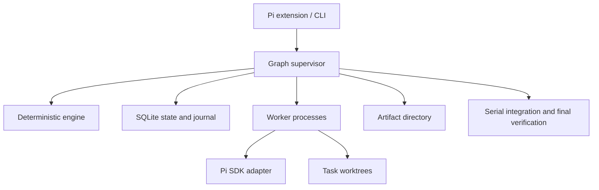

# Architecture

> **Archived 2026-09-24.** Historical baseline only; superseded by the [design document](../design.md) and [ledger](../implementation-ledger.json). Do not update.

Initial design overview. The [design document](../design.md)
refines runtime semantics and boundaries after the predecessor review; follow its
[ledger](../implementation-ledger.json) for implementation order and status.

## Scope

Start with one local repository, one supervisor, a Pi terminal extension, and bounded
SDK worker processes. Distributed workers and a web UI are later decisions. The root
graph is depth 0, child graphs depth 1, and grandchild graphs depth 2.



The supervisor is a planned runtime within `engine`, with startup through `cli`.
It is deliberately not started by module imports. The extension will connect to it
and reconnect after UI reloads; protocol and transport are not implemented yet.

## Boundaries

`contracts` has no dependency on Pi. `engine` performs deterministic policy and state
transitions. `storage` owns persistence interfaces, with a single SQLite writer to be
implemented. `pi-adapter` owns SDK compatibility. `worker` translates a scoped assignment
into a session inside an isolated worker process. `pi-extension` owns Pi commands,
rendering, and input routing. `cli` is the local composition entry point.

Use explicit injection at these boundaries. The adapter currently requires an injected
Pi factory and options; it must not discover and start unrestricted workers itself.

## Planning and graph semantics

Capture the user objective, constraints, acceptance criteria, baseline, and budget.
Inspect enough context to choose a small-change, bug, feature, or investigation template.
The planner proposes structured data. Runtime schema checks precede semantic validation.
Tiny tasks may remain a single node.

Within a graph, dependencies form a DAG. A separate ownership relationship connects a
parent node to a child graph. Loop iterations create new attempts or graph revisions;
they do not insert backward dependency edges. Root-wide validation must also prevent
wait cycles across graph ownership boundaries.

Agents request graph changes and spawning. The supervisor validates the proposal against
the current revision, scope, budget, and permissions before persisting it. Graph revisions
are immutable. Changing an input invalidates downstream acceptance evidence.

## Roles

| Role | Purpose | Default authority to implement |
| --- | --- | --- |
| Planner | Decompose a scoped objective | Read and propose plans |
| Explorer | Answer bounded questions | Read/search |
| Implementer | Produce a candidate patch | Write assigned workspace |
| Verifier | Execute checks and collect evidence | Controlled test execution |
| Reviewer | Inspect correctness and omissions | Read code and evidence |
| Integrator | Combine accepted candidates | Write integration workspace |

These are task configurations, not permanent agent processes. A parent node may
coordinate a child graph, but scheduling, accounting, and recovery remain ordinary code.
Role labels alone do not enforce permissions; the worker executor must enforce scope.

## Scheduling, budgets, and loops

One global queue covers all generations. A waiting parent releases its worker permit
and any resource needed by its descendants. A parent resumes only after the child
outcome is durably recorded. Cancel propagates down; outcomes propagate up.

Initial policy suggestions are 4 concurrent sessions, 24 total nodes, depth 2, 2 repair
rounds, and 2 major replans. These values are exported but not currently enforced by a
scheduler. Every run also needs explicit token/tool limits and a deadline. Reserve child
allocations atomically from the root envelope and keep budget for integration and checks.

Keep provider retries, Pi's internal reasoning loop, task repair loops, investigation
loops, and replanning distinct. Each loop has a bound and an evidence-based stopping
condition. Repeated failures without new evidence must stop or request a changed plan.
Budget exhaustion is a terminal outcome, never permission to weaken acceptance criteria.

## Workspaces and acceptance

Capture a reproducible baseline including user changes. Allocate separate Git worktrees
to concurrent writers and assign file/module ownership. Workers return candidate patches
and evidence, never directly update the user's checkout. A single integration authority
applies patches to a run branch and verifies the combined tree.

An agent finishing a turn, a tool returning exit code 0, and a task being accepted are
different events. Acceptance must cite the required evidence and exact revision. A child
result remains provisional until parent integration checks pass. Model sessions cannot
directly grant acceptance or relax their own contracts.

Worktrees are edit isolation, not a security boundary. Pi extensions run with host
permissions. Filesystem/process/network restrictions require a policy-aware executor
or OS sandbox. Do not load uncontrolled extensions into autonomous workers.

## Persistence and recovery

Planned local layout (ignored by Git):

```text
.auto-pi-lot/
  state.sqlite
  artifacts/sha256/
  sessions/
  worktrees/
```

Use SQLite for runs, graph revisions, nodes/edges, attempts, events, artifact links,
budget reservations, worker leases, and effect records. Commit current state and journal
events in the same transaction. Store large artifacts outside the database by hash;
use atomic writes and reconcile orphaned blobs. Pi session history is not graph state.

Persist intent before dispatch. Attempts have IDs, leases, and fencing tokens; stale
workers cannot commit accepted results. Spawn requests have idempotency keys. On restart,
reconcile live processes and uncertain external effects before dispatching replacement
attempts. Arbitrary shell commands do not have exactly-once guarantees.

Evaluate upstream `pi-durable` before implementing SQLite, but retain the graph-specific
storage interface. Do not add a graph database, Redis, or vector database for the first
local version. SQLite migration/backup strategy and power-loss durability must be chosen
and tested before recovery is advertised.

## User control and context

Planned commands: `/graph on|off|status|pause|resume|cancel`. `off` changes future routing;
it does not silently cancel existing work. Pausing stops new dispatch and checkpoints
in-flight work according to a documented policy. Cancelling stops descendant work.
Only the status notification exists in this scaffold.

Record user steering as an event, identify affected nodes, and revise their contracts.
Provide workers compact task packets, relevant artifacts, and decisions with provenance.
Keep hypotheses separate from verified facts. Do not automatically copy full ancestral
transcripts into every descendant.

## Upstream references

- [Pi SDK](https://github.com/earendil-works/pi/blob/main/packages/coding-agent/docs/sdk.md)
- [Pi extensions](https://github.com/earendil-works/pi/blob/main/packages/coding-agent/docs/extensions.md)
- [Pi durable](https://github.com/earendil-works/pi/blob/main/packages/durable/README.md)
- [SQLite WAL](https://www.sqlite.org/wal.html)
- [Git worktrees](https://git-scm.com/docs/git-worktree)

Upstream `main` may differ from the pinned SDK release. Treat installed declarations
and compatibility tests as the authority for implemented calls.
